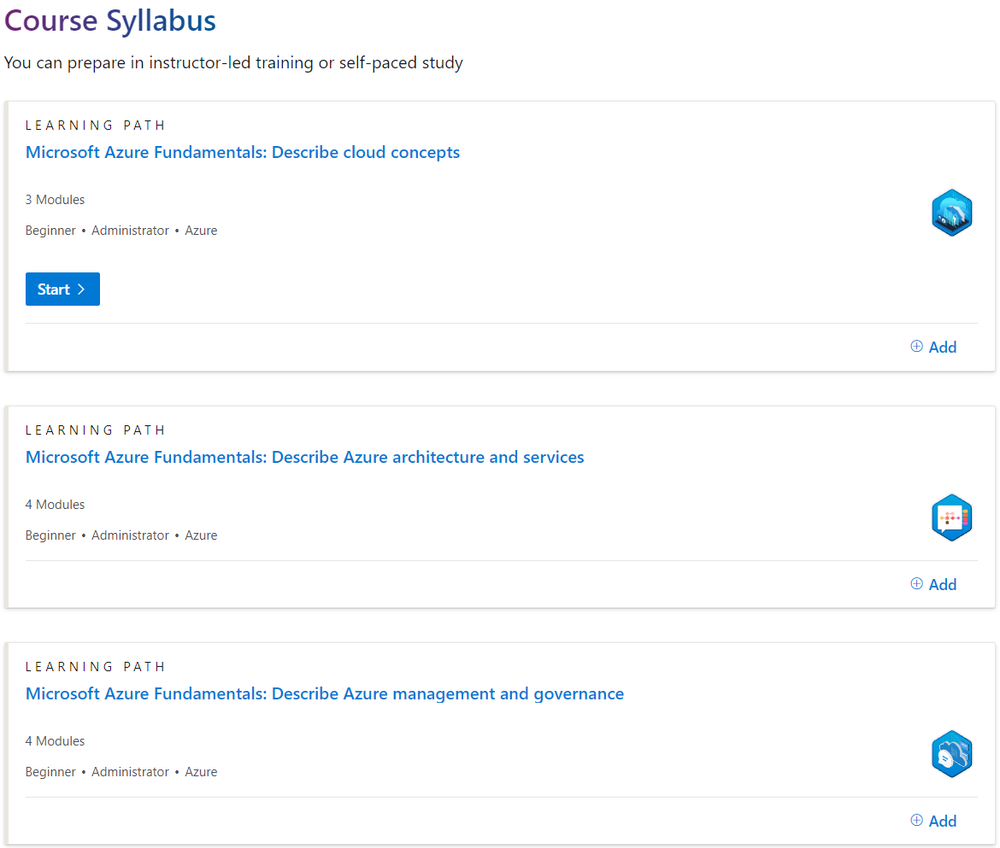

## Hi there 👋

My name is Lucas Hoff Schmidt.

My journey in software development began with creating an endless runner game in C# using Unity as a solo developer. This experience ignited my passion for coding, and I've been expanding my knowledge ever since.

### Project Highlights
#### Adventures of Chirpie
An endless runner game I made in C# with Unity for Google Play Store, itch.io and Unity Distribution Portal. 
It features 8 different worlds with their own unique ambience, achievements, pickups, powerups, upgrades, different player characters, daily rewards, slot machine minigames and player trophies.  
I made the game using gimp for designing assets, FL Studio for music, Bfxr for sound, Unity for game development and Shotcut for making videos.

##### Trailer
This video shows a brief overview of what the game has to offer.

   

##### Play the game
You can play the game by downloading the game files from itch.io. 
[Game Link](https://avillion.itch.io/adventures-of-chirpie)

##### Overview
This video shows an overview of the different elements in the game, segmented by UI, worlds and powerups.

   

#### Mini Market
An E-Commerce website that I am developing. Mini Market is a marketplace for individuals to buy and sell reusable and affordable items.
Technologies used include React, Redux, Node, Typescript, Jest, Playwright, Nodemailer and Stripe. 

### Courses and Certifications
I have completed several key courses that have significantly contributed to my software development knowledge.

1. **[Software Development Fundamentals](https://coursecareers.com/explore/software-dev-fundamentals)** by CourseCareers  
   
   
2. **[Backend Specialization](https://coursecareers.com/explore/software-dev-backend)** by CourseCareers  
   
   
3. **[Azure Fundamentals](https://learn.microsoft.com/en-us/training/courses/az-900t00)** by Microsoft  
   

### Interests and Hobbies
Outside of work, I enjoy:
- Weightlifting
- Learning new languages
- Watching sci-fi movies
- Playing foosball
- Board game nights

### Connect with Me
- [LinkedIn](https://www.linkedin.com/in/lucas-hoff-schmidt-594855156/)
- Email: [Lucashoffschmidt@gmail.com](mailto:Lucashoffschmidt@gmail.com)

Thank you for visiting my profile!

